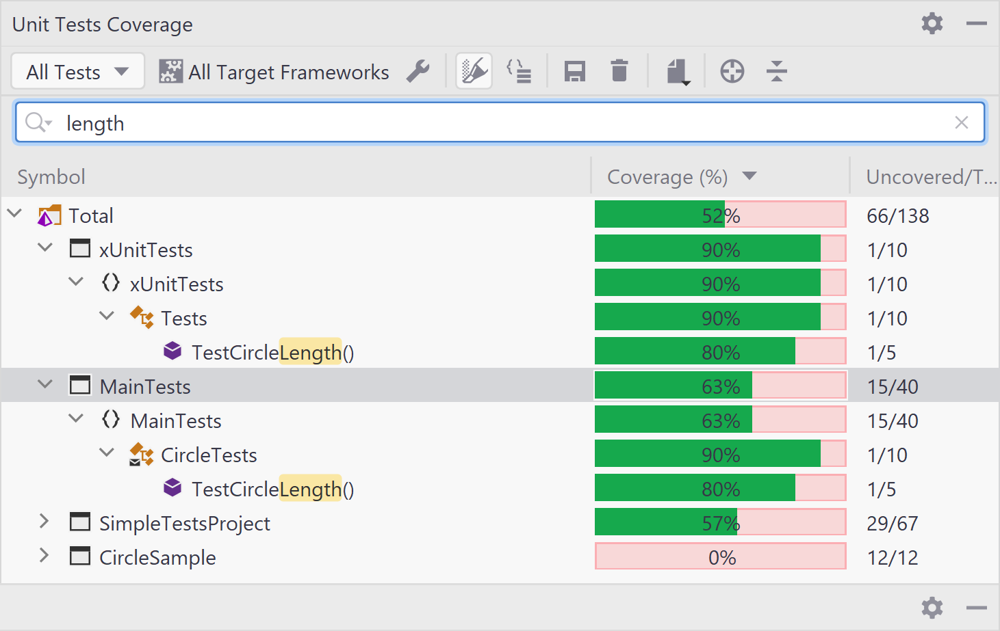

# Coverage

## Introducción 

La **cobertura** (o **coverage**) de un código corresponde a una métrica 
de prueba de software que 
determina la cantidad de líneas de código que se validan 
con éxito en un procedimiento del test, lo que a 
su vez ayuda a analizar la exhaustividad con la que se 
verifica un software.

Las empresas deben 
asegurarse de que el software que desarrollan 
cumpla con todas las características esenciales 
de calidad: 

* corrección
* confiabilidad
* eficacia,
* seguridad
* mantenibilidad. 

Esto solo puede ser posible revisando minuciosamente el producto de software.


La cobertura de código es una de esas métricas de prueba de software que puede ayudar a evaluar el rendimiento de la prueba y los aspectos de calidad de cualquier software.

### Beneficios

El análisis de cobertura de código solo se puede utilizar 
para la validación de casos de prueba que se ejecutan en el 
código fuente y no para la evaluación del producto de software.
Además, no evalúa si el código fuente está libre de errores ni prueba si un código escrito es correcto.

Algunos beneficios:

* **Fácil mantenimiento del código base**: escribir código escalable es fundamental para ampliar el programa de software mediante la introducción de funcionalidades nuevas o modificadas. Sin embargo, es difícil determinar si el código escrito es escalable. 


* **Exposición de código incorrecto**: el análisis continuo ayudará a los desarrolladores a comprender el código incorrecto, muerto y sin usar. 


* **Tiempo de comercialización más rápido**: con la ayuda de esta métrica, los desarrolladores pueden terminar el proceso de desarrollo de software más rápido, aumentando así su productividad y eficiencia. 


### ¿Cómo se mide?

Para calcular el porcentaje de cobertura del código,
simplemente use la siguiente fórmula:

> **Porcentaje de cobertura de código** = (Número de líneas de código ejecutadas por un algoritmo de prueba/Número total de líneas de código en un componente del sistema) * 100.

 



## Pytest-Cov

La librería [pytest-cov](https://pytest-cov.readthedocs.io/en/latest/) es el plugin utilizado para los informes de cobertura.

En comparación con el uso de
`coverage run`, este complemento tiene algunos extras:

  - **Soporte de subprocesos**: puede bifurcar o ejecutar cosas en un
    subproceso y estará cubierto sin ningún problema.
  - **Soporte de `Xdist`**: puede usar todas las funciones de pytest-xdist y
    aún obtener cobertura.
  - **Comportamiento constante de Pytest**. Si ejecuta la sentencia
    `coverage run -m pytest`, tendrá `sys.path` ligeramente diferente
    (CWD estará en él, a diferencia de cuando se ejecuta `pytest`).
  - Es posible generar cualquier combinación de informes para una sola
    ejecución de test.
  - Los informes disponibles son terminales (con o sin los números de
    línea que faltan), HTML, XML y código fuente anotado.

## Casos de Usos

Lo primero es replicar el ejemplo de la seción [Pytest](pytest.md).

### Caso 01

El informe del terminal sin números de línea (default):


``` python
!pytest --cov-report term --cov=src
```


    ============================= test session starts ==============================
    platform linux -- Python 3.8.5, pytest-5.4.3, py-1.10.0, pluggy-0.13.1
    rootdir: /home/fralfaro/PycharmProjects/python_development_tools/python_development_tools/testing
    plugins: hypothesis-5.49.0, cov-2.11.1
    collected 7 items                                                              
    
    src/tests/algo_test.py ....                                              [ 57%]
    src/tests/srel_test.py ...                                               [100%]
    
    ----------- coverage: platform linux, python 3.8.5-final-0 -----------
    Name                     Stmts   Miss  Cover
    --------------------------------------------
    src/tests/__init__.py        0      0   100%
    src/tests/algo_test.py      15      0   100%
    src/tests/srel_test.py       6      0   100%
    src/utils/__init__.py        0      0   100%
    src/utils/algo.py           24      0   100%
    src/utils/srel.py            2      0   100%
    --------------------------------------------
    TOTAL                       47      0   100%
    
    
    ============================== 7 passed in 0.09s ===============================


### Caso 02

El informe de la terminal con números de línea:


``` python
!pytest --cov-report term-missing --cov=src
```


    ============================= test session starts ==============================
    platform linux -- Python 3.8.5, pytest-5.4.3, py-1.10.0, pluggy-0.13.1
    rootdir: /home/fralfaro/PycharmProjects/python_development_tools/python_development_tools/testing
    plugins: hypothesis-5.49.0, cov-2.11.1
    collected 7 items                                                              
    
    src/tests/algo_test.py ....                                              [ 57%]
    src/tests/srel_test.py ...                                               [100%]
    
    ----------- coverage: platform linux, python 3.8.5-final-0 -----------
    Name                     Stmts   Miss  Cover   Missing
    ------------------------------------------------------
    src/tests/__init__.py        0      0   100%
    src/tests/algo_test.py      15      0   100%
    src/tests/srel_test.py       6      0   100%
    src/utils/__init__.py        0      0   100%
    src/utils/algo.py           24      0   100%
    src/utils/srel.py            2      0   100%
    ------------------------------------------------------
    TOTAL                       47      0   100%
    
    
    ============================== 7 passed in 0.10s ===============================


### Caso 03

El informe de la terminal con `skip covered`:


``` python
!pytest --cov-report term:skip-covered --cov=src
```


    ============================= test session starts ==============================
    platform linux -- Python 3.8.5, pytest-5.4.3, py-1.10.0, pluggy-0.13.1
    rootdir: /home/fralfaro/PycharmProjects/python_development_tools/python_development_tools/testing
    plugins: hypothesis-5.49.0, cov-2.11.1
    collected 7 items                                                              
    
    src/tests/algo_test.py ....                                              [ 57%]
    src/tests/srel_test.py ...                                               [100%]
    
    ----------- coverage: platform linux, python 3.8.5-final-0 -----------
    Name    Stmts   Miss  Cover
    ---------------------------
    ---------------------------
    TOTAL      47      0   100%
    
    6 files skipped due to complete coverage.
    
    
    ============================== 7 passed in 0.10s ===============================


### Caso 04

Estas tres opciones de informe se envían a archivos sin mostrar nada
en el terminal:


``` python
!pytest --cov-report html \
        --cov-report xml \
        --cov-report annotate \
        --cov=src
```


    ============================= test session starts ==============================
    platform linux -- Python 3.8.5, pytest-5.4.3, py-1.10.0, pluggy-0.13.1
    rootdir: /home/fralfaro/PycharmProjects/python_development_tools/python_development_tools/testing
    plugins: hypothesis-5.49.0, cov-2.11.1
    collected 7 items                                                              
    
    src/tests/algo_test.py ....                                              [ 57%]
    src/tests/srel_test.py ...                                               [100%]
    
    ----------- coverage: platform linux, python 3.8.5-final-0 -----------
    Coverage annotated source written next to source
    Coverage HTML written to dir htmlcov
    Coverage XML written to file coverage.xml
    
    
    ============================== 7 passed in 0.15s ===============================


### Caso 05

Se puede especificar la ubicación de salida para cada uno de estos
informes. La ubicación de salida del informe XML es un archivo. Donde,
como ubicación de salida para los informes HTML y de código fuente
anotado son directorios:


``` python
! pytest --cov-report html:cov_html \
        --cov-report xml:cov.xml \
        --cov-report annotate:cov_annotate \
        --cov=src
```


    ============================= test session starts ==============================
    platform linux -- Python 3.8.5, pytest-5.4.3, py-1.10.0, pluggy-0.13.1
    rootdir: /home/fralfaro/PycharmProjects/python_development_tools/python_development_tools/testing
    plugins: hypothesis-5.49.0, cov-2.11.1
    collected 7 items                                                              
    
    src/tests/algo_test.py ....                                              [ 57%]
    src/tests/srel_test.py ...                                               [100%]
    
    ----------- coverage: platform linux, python 3.8.5-final-0 -----------
    Coverage annotated source written to dir cov_annotate
    Coverage HTML written to dir cov_html
    Coverage XML written to file cov.xml
    
    
    ============================== 7 passed in 0.17s ===============================


### Caso 06

La opción de informe final también puede suprimir la impresión en el
terminal:


``` python
!pytest --cov-report= --cov=src 
```


    ============================= test session starts ==============================
    platform linux -- Python 3.8.5, pytest-5.4.3, py-1.10.0, pluggy-0.13.1
    rootdir: /home/fralfaro/PycharmProjects/python_development_tools/python_development_tools/testing
    plugins: hypothesis-5.49.0, cov-2.11.1
    collected 7 items                                                              
    
    src/tests/algo_test.py ....                                              [ 57%]
    src/tests/srel_test.py ...                                               [100%]
    
    
    
    ============================== 7 passed in 0.12s ===============================


Este modo puede ser especialmente útil en servidores de integración
continua, donde se necesita un archivo de cobertura para el
procesamiento posterior, pero no es necesario ver un informe local. Por
ejemplo, las pruebas realizadas en `Travis-CI` podrían generar un
archivo `.coverage` para usar con `Coveralls`.

## Porcentaje Ideal de cobertura

Una sorprendente cobertura de código del 100 % significa que el
código está 100 % libre de errores. Ningún error indica que los casos 
de prueba han cubierto todos los criterios y requisitos de la aplicación de software.
Entonces, si ese es el caso, 

* ¿cómo evaluamos si los scripts de prueba han cumplido con una amplia gama de posibilidades? 
* ¿Qué pasa si los casos de prueba han cubierto los requisitos incorrectos?
* ¿Qué pasa si los casos de prueba no cumplieron con algunos requisitos importantes? 

Entonces, ¿cuál es el porcentaje de cobertura ideal que preguntas? El único enfoque y objetivo de los desarrolladores y tester debería ser 
escribir tests que no sean vagos. No concentrarse en lograr una cobertura del 100 por ciento.

El análisis debe combinarse con tests robustos y escalables, que cubran todas las áreas funcionales y no funcionales del código fuente.
