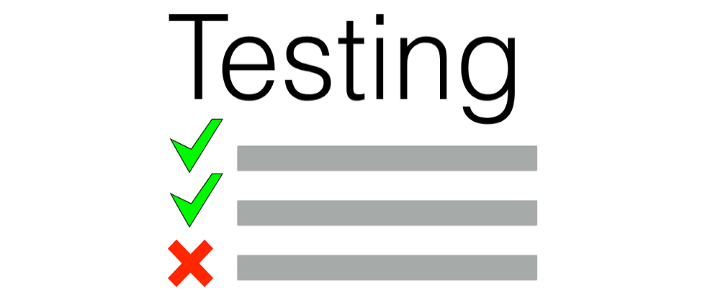

# Bienvenido a Python Testing

El objetivo de este repositorio es dar una breve introducción sobre cómo testear en Python 
(Test-driven development, Pytest, Coverage , etc.)

Para esto tenemos la siguiente tabla de contenidos:

* [Introducción al TDD](intro.md)
* [Introducción Pytest](pytest.md)
* [Introducción Coverage](coverage.md)

> **Nota**: El repositorio lo puede encontrar en el siguiente link: [fralfaro/python_testing](https://github.com/fralfaro/python_testing).

